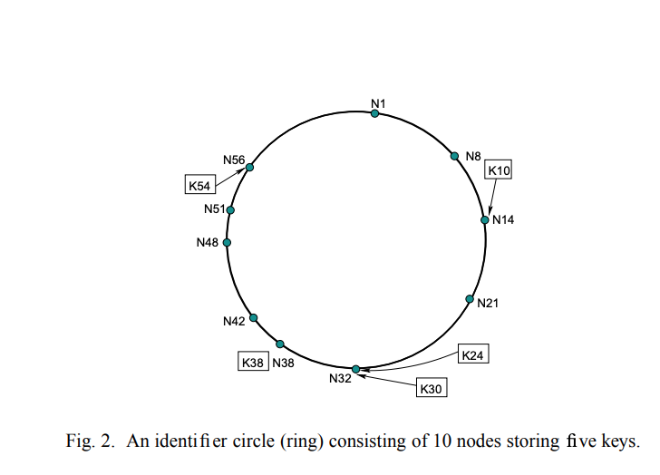

# Reference 
https://pdos.csail.mit.edu/papers/ton:chord/paper-ton.pdf
# Abstract
- A fundamental problem that confronts peer to peer application is the efficient location of the node that stores a desired data item.
- `Chord` is a distributed lookup protocol that address this problem
- `Chord` provides support for just one operation: Given a key, it maps key onto nodes
- Data location can be easily implemented on top of Chord by associating a key with each data item and storing the key/data pair at the node to which the key maps.
- Chord adapts efficiently as nodes join and leave the system and can answer query even if the system is continuously changing
- In chord, communication cost and and state maintained by each node scal logarithmically with number of Chord nodes
- Chord uses consistent hashing to assign keys to chord nodes.
# Consistent hashing Vs Chord
- Consistent hashing tends to balance load, since each nodes receives roughly the same number of keys, and require little movement of keys when nodes join and leave the system. 
- Previous work on consistent hashing assumes that each node is aware of most of the other nodes in the system. 
- An approach doesn't scale well to large number of nodes.
- In contrast, each `Chord` nodes `routing` information about only a few other nodes. 
- Because `routing` table is distributed, a `Chord` nodes communicates with other nodes in order to perform a lookup. 
- In steady state, in `N` node system, each node maintains information about only `O(log N)` other nodes
- It resolves, all lookup via `O(log N)` messages to other nodes
- Chord maintains its routing information as nodes join and leaves the system 
# Chord limitation
- A Chord node requires information about `O(log N)` other nodes for efficiently routing. 
- But performance degrade gracefully when that information is outdated
- This is important in practice bcz node will join and leave arbitrarily and consistencies of even `O (log N)` state may be hard to maintain.
- Only one piece of information per node needs to be correct in order for Chord to guarantee correct ( though possibly slow) routing for queries
# Related Work
## DNS
- DNS provides a lookup service, with hostname as key and IP address (and other hosts information) as value
- Chord could provides same service by hashing each hostname to a key 
- Chord based DNS would require no special servers, while ordinary DNS relies on a set of special root servers. 
- DNS requires manual management of the routing information(NS record) that allows client to navigate the name server hierarchy
- Chord on other hand, automatically maintains the correctness of the analogous routing information.
## Freenet
- The Freenet  peer to peer storage system, like Chord, is decentralized and symmetric and automatically adopts when hosts leave or join
- Freenet doesn't assign responsibility for documents to specify servers, instead it lookups take the form of searches for cached copies
- This allows Freenet to provide a degree of anonymity, but prevents it from guaranteeing retrieval of existing documents or from providing low bounds on retrieval costs.
- Chord does not provide anonymity, but its lookup operation runs in predictable time and always results in success or definitive failure.

## Ohaha
- The Ohaha system uses a consistent hashing-like algorithm map documents to nodes, and Freenet-style query routing
- As a result, it shares some of the weaknesses of Freenet
## Globe
- The Globe system has a wide-area location service to map object identifiers to the locations of moving objects.
- Globe arranges the Internet as a hierarchy of geographical, topological, or administrative domains, effectively constructing a static world-wide search tree, much like DNS. 
- Information about an object is stored in a particular leaf domain, and pointer caches provide search shortcuts
- The Globe system handles high load on the logical root by partitioning objects among multiple physical root servers using hash-like techniques

# System model
Chord simplifies the design of peer to peer systems and applications based on it by addressing these difficult problems
- Load balance: Chord acts as a distributed hash function, spreading keys evenly over the nodes; this provides a degree of natural load balance
- Decentralization: Chord is fully distributed: no node is more important than any other. This improves robustness and makes Chord appropriate for loosely-organized peer-to-peer applications.
- Scalability: The cost of a Chord lookup grows as the `log` of the number of nodes, so even very large systems are feasible. No parameter tuning is required to achieve this scaling
- Availability: Chord automatically adjusts its internal tables to reflect newly joined nodes as well as node failures, ensuring that, barring major failures in the underlying network, the node responsible for a key can always be found. This is true even if the system is in a continuous state of change.
- Flexible naming: Chord places no constraints on the structure of the keys it looks up: the Chord key-space is flat. This gives applications a large amount of flexibility in how they map their own names to Chord keys

The application interacts with Chord in two main ways.
- lookup(key) function that yields the IP address of the node responsible for the key
- Chord software on each node notifies the application of changes in the set of keys that the node is responsible for.

This allows the application software to, for example, move corresponding values to their new homes when a new node joins. The application using Chord is responsible for providing any desired authentication, caching, replication, and user-friendly naming of data.

# Chord Usage
## Cooperative mirroring
- in which multiple providers of content cooperate to store and serve each others’ data.
## Time-shared storage
## Distributed indexes
## Large-scale combinatorial search
# THE CHORD PROTOCOL
## Overview
- At its heart, Chord provides fast distributed computation of a hash function mapping keys to nodes responsible for them
- Chord assigns keys to nodes with consistent hashing which has several desirable properties. 
- With high probability the hash function balances load (all nodes receive roughly the same number of keys). 
- Also with high probability, when an N th node joins (or leaves) the network, only a O(1/N) fraction of the keys are moved to a different location—this is clearly the minimum necessary to maintain a balanced load.
- Chord improves the scalability of consistent hashing by avoiding the requirement that every node know about every other node.
- A Chord node needs only a small amount of “routing” information about other nodes. 
- Because this information is distributed, a node resolves the hash function by communicating with other nodes.
- In an N-node network, each node maintains information about only O(log N) other nodes, and a lookup requires O(log N) messages.
## Consistent Hashing
- The consistent hash function assigns each node and key an mbit identifier using SHA-1 as a base hash function. 
- A node’s identifier is chosen by hashing the node’s IP address, while a key identifier is produced by hashing the key. 
- The identifier length m must be large enough to make the probability of two nodes or keys hashing to the same identifier negligible.
- Consistent hashing assigns keys to nodes as follows. 
- Identifiers are ordered on an identifier circle modulo pow(2, m). 
- Key k is assigned to the first node whose identifier is equal to or follows (the identifier of) k in the identifier space. 
- This node is called the successor node of key k, denoted by successor(k). 
- If identifiers are represented as a circle of numbers from 0 to pow(2, m − 1), then successor(k) is the first node clockwise from k. 
- Following fig shows a Chord ring with m = 6. 

- The Chord ring has 10 nodes and stores five keys. 
The successor of identifier 10 is node 14, so key 10 would be located at node 14. 
- Similarly, keys 24 and 30 would be located at node 32, key 38 at node 38, and key 54 at node 56.
- Consistent hashing is designed to let nodes enter and leave the network with minimal disruption. 
- To maintain the consistent hashing mapping when a node n joins the network, certain keys previously assigned to n’s successor now become assigned to n
- When node n leaves the network, all of its assigned keys are
reassigned to n’s successor
- In the example above, if a node were to join with identifier 26, it would capture the key with identifier 24 from the node with identifier 32
- 
